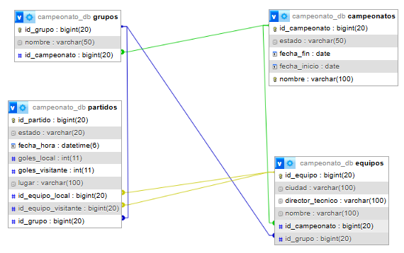

# ⚽ Sistema de Gestión de Campeonatos de Fútbol

## Arquitectura de Software - MVC con Spring Boot

---

## 📚 Descripción

Sistema para la gestión integral de campeonatos de fútbol que permite:

- Crear y administrar campeonatos.
- Registrar equipos participantes.
- Generar grupos automáticos y aleatorios.
- Crear calendario de partidos bajo modalidad todos contra todos.
- Registrar resultados de partidos.
- Calcular automáticamente las tablas de posiciones.
- Aplicar criterios de desempate como diferencia de goles, goles a favor y resultado entre equipos.

---

## 🏗️ Arquitectura

El sistema implementa el patrón **MVC**: Modelo - Vista - Controlador.

| Capa MVC | Implementación Spring Boot |
|---|---|
| Modelo | Entidades JPA en `models/` |
| Vista | Plantillas Thymeleaf en `templates/` |
| Controlador | Controladores en `controllers/` |

### Capas adicionales

| Capa | Carpeta | Responsabilidad |
|---|---|---|
| Repositorios | `interfaces/` | Acceso a datos con JPA |
| Interfaces Servicio | `interfacesServices/` | Contratos de negocio |
| Servicios | `services/` | Lógica de negocio |

---

## 📊 Diagrama de Base de Datos



### Tablas

| Tabla | Descripción |
|---|---|
| `campeonatos` | Datos del campeonato: nombre, fechas y estado |
| `equipos` | Equipos participantes: nombre, ciudad y director técnico |
| `grupos` | Grupos del campeonato: Grupo A, Grupo B, Grupo C, etc. |
| `partidos` | Partidos con resultados: local, visitante y goles |

### Relaciones uno a muchos

- Campeonato → Equipos `(1:N)`
- Campeonato → Grupos `(1:N)`
- Grupo → Equipos `(1:N)`
- Grupo → Partidos `(1:N)`
- Equipo → Partidos como local `(1:N)`
- Equipo → Partidos como visitante `(1:N)`

---

## 🛠️ Tecnologías utilizadas

- Java 17
- Spring Boot 3.2.5
- Spring Data JPA
- Thymeleaf
- MySQL
- Bootstrap 5
- Maven

---

## 📁 Estructura del proyecto

```text
src/
├── main/
│   ├── java/com/campeonato/gestioncampeonato/
│   │   ├── controllers/          # Controladores MVC
│   │   │   ├── CampeonatoController.java
│   │   │   ├── EquipoController.java
│   │   │   ├── GrupoController.java
│   │   │   └── PartidoController.java
│   │   ├── models/               # Entidades JPA
│   │   │   ├── Campeonato.java
│   │   │   ├── Equipo.java
│   │   │   ├── Grupo.java
│   │   │   └── Partido.java
│   │   ├── interfaces/           # Repositorios JPA
│   │   │   ├── ICampeonato.java
│   │   │   ├── IEquipo.java
│   │   │   ├── IGrupo.java
│   │   │   └── IPartido.java
│   │   ├── interfacesServices/   # Interfaces de Servicio
│   │   │   ├── ICampeonatoService.java
│   │   │   ├── IEquipoService.java
│   │   │   ├── IGrupoService.java
│   │   │   └── IPartidoService.java
│   │   └── services/             # Lógica de Negocio
│   │       ├── CampeonatoService.java
│   │       ├── EquipoService.java
│   │       ├── GrupoService.java
│   │       └── PartidoService.java
│   └── resources/
│       ├── application.properties
│       └── templates/            # Vistas Thymeleaf
│           ├── index.html
│           ├── listCampeonato.html
│           ├── formCampeonato.html
│           ├── listEquipo.html
│           ├── formEquipo.html
│           ├── listGrupo.html
│           ├── listPartido.html
│           ├── formPartido.html
│           └── tablaPosiciones.html
```

---

## 🎯 Reglas del sistema

### Sistema de puntuación

| Resultado | Puntos |
|---|---:|
| Victoria | 3 pts |
| Empate | 1 pt |
| Derrota | 0 pts |

### Criterios de desempate

1. Diferencia de goles `DG`.
2. Goles a favor `GF`.
3. Resultado entre equipos empatados.

---

## 🚀 Instalación y ejecución

### Requisitos previos

- Java JDK 17 o superior.
- MySQL, se recomienda usar XAMPP.
- Maven, incluido con `mvnw`.

### Pasos para ejecutar

1. Clonar el repositorio:

```bash
git clone https://github.com/softhamck/gestion-campeonatos-futbol.git
```

2. Crear la base de datos:

- Abrir phpMyAdmin: `http://localhost/phpmyadmin`
- Crear una base de datos llamada `campeonato_db`.
- Usar cotejamiento `utf8mb4_general_ci`.

3. Configurar la conexión:

- Verificar el archivo `src/main/resources/application.properties`.
- Ajustar el usuario y la contraseña de MySQL si es necesario.

4. Ejecutar la aplicación:

```bash
./mvnw spring-boot:run
```

5. Abrir en el navegador:

```text
http://localhost:8080
```

---


## 📄 Licencia

Este proyecto fue desarrollado con fines académicos para la asignatura de Arquitectura de Software.
