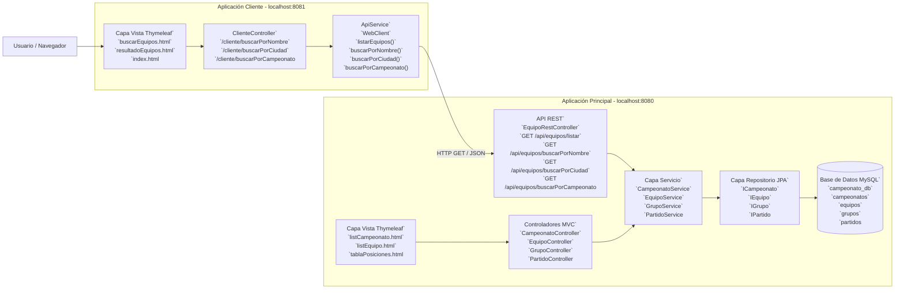

# Diagrama de Arquitectura - API REST + Cliente



# Flujo de información

1. **Cliente (Navegador)** solicita búsqueda en `localhost:8081`.
2. **ClienteController** recibe la petición.
3. **ApiService** usa `WebClient` para llamar a la API REST.
4. Se realiza una petición HTTP GET a:

   ```http
   GET localhost:8080/api/equipos/buscarPorNombre?nombre=X
   ```
5. **EquipoRestController** procesa la petición.
6. **IEquipo (JPA)** consulta la base de datos MySQL.
7. **MySQL** retorna los datos.
8. **EquipoRestController** convierte la respuesta a JSON.
9. **HTTP Response** devuelve un JSON con los equipos encontrados.
10. **ApiService** recibe y deserializa el JSON.
11. **ClienteController** envía los datos a la vista Thymeleaf.
12. **Cliente (Navegador)** muestra los resultados en una tabla HTML.
